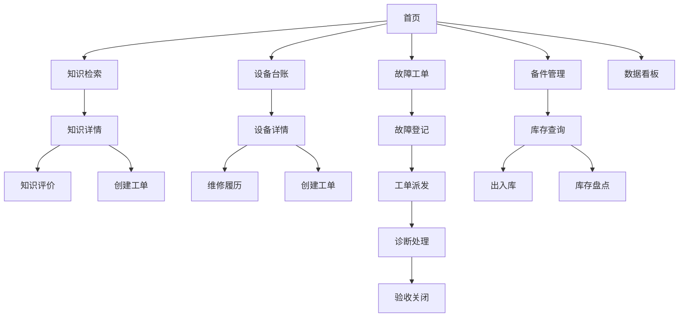
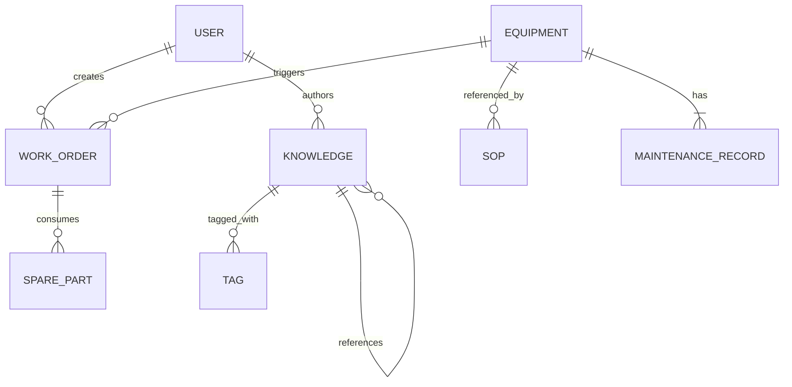

# 设备检修知识系统 - 产品需求文档 (PRD)

## 1. 产品概述

设备检修知识系统是一款面向工业制造企业的智能化知识管理平台，旨在构建以**知识图谱**为骨架、以**智能检索**为神经、以**大模型推理**为大脑的设备检修知识中枢。系统解决设备复杂度与人才储备矛盾、知识流失与经验传承矛盾、响应效率与生产压力矛盾、数据孤岛与决策需求矛盾四大核心问题。

**目标用户**：维修工程师、设备管理员、技术主管、生产管理人员

**核心价值**：
- 维修人员：故障处理时间缩短40%以上，新手也能处理70%常见故障
- 管理层：维修过程透明化，为精益管理提供数据支撑
- 组织：将个人经验转化为组织资产，构建持续进化的知识体系

---

## 2. 核心功能模块

### 2.1 用户角色

| 角色 | 说明 | 核心权限 |
|------|------|---------|
| 维修工程师 | 一线设备维修人员 | 故障报修、工单处理、知识查阅、SOP执行 |
| 设备管理员 | 设备台账管理者 | 设备管理、备件管理、数据统计 |
| 技术专家 | 高级维修人员 | 知识编写、图谱编辑、工单审核 |
| 主管 | 部门管理者 | 全部功能、数据看板、人员绩效 |
| 管理员 | 系统管理者 | 系统配置、权限管理 |

### 2.2 功能模块清单

1. **多模态知识检索系统** - 全文检索、分类筛选、语义搜索、图片搜索、语音搜索
2. **标准化作业指引系统(SOP)** - SOP创建、步骤跟踪、异常处理、离线执行
3. **知识图谱可视化系统** - 2D力导向图、3D全景视图、节点搜索、路径分析
4. **知识全生命周期管理** - 知识创建、审核流程、版本控制、评价反馈
5. **设备台账管理系统** - 设备档案、状态管理、维修履历
6. **故障记录与工单管理系统** - 故障登记、诊断、处理、验收、工单协作
7. **备件库存管理系统** - ABC分类、安全库存、出入库、盘点
8. **统计分析看板** - 设备健康度、维修效率、知识贡献分析

---

## 3. 核心页面设计

### 3.1 页面清单

| 页面名称 | 所属模块 | 功能描述 |
|---------|---------|---------|
| 首页仪表盘 | 系统首页 | 概览统计、快速入口、待办事项 |
| 知识检索页 | 知识检索 | 多模式搜索、结果展示、筛选过滤 |
| 知识详情页 | 知识管理 | 知识内容、相关推荐、评价互动 |
| 知识编辑页 | 知识管理 | 富文本编辑、多媒体上传、模板录入 |
| SOP列表页 | SOP管理 | SOP分类浏览、状态筛选、版本管理 |
| SOP详情页 | SOP管理 | 流程图展示、步骤跟踪、检查清单 |
| 图谱总览页 | 图谱管理 | 2D/3D图谱展示、节点操作、子图筛选 |
| 设备台账页 | 设备管理 | 设备列表、状态看板、筛选查询 |
| 设备详情页 | 设备管理 | 设备档案、参数信息、维修履历 |
| 故障登记页 | 工单管理 | 故障上报、多媒体证据、位置标记 |
| 工单列表页 | 工单管理 | 工单看板、状态流转、筛选派单 |
| 工单详情页 | 工单管理 | 诊断过程、执行记录、协作讨论 |
| 备件列表页 | 备件管理 | 库存查询、预警提示、出入库 |
| 库存详情页 | 备件管理 | 批次管理、安全库存、呆滞分析 |
| 数据看板页 | 统计分析 | 设备健康度、维修效率、趋势分析 |

### 3.2 页面流程图

---

## 4. 用户界面设计

### 4.1 设计风格

- **设计语言**：Industrial Professional - 工业专业风格
- **主色调**：科技蓝 #0066FF（专业可信）、状态色（成功绿#22C55E、警告黄#F59E0B、危险红#EF4444）
- **辅助色**：深灰#1F2937、中灰#6B7280、浅灰#F3F4F6
- **字体**：思源黑体（中文）+ Inter（英文），层次分明的字号体系
- **布局**：左侧导航 + 右侧内容区，卡片化信息展示
- **图标**：Lucide Icons，线性风格
- **动效**：页面切换淡入淡出，卡片悬停微提升，数据加载骨架屏

### 4.2 页面设计要点

| 页面 | 布局特点 | 核心组件 |
|------|---------|---------|
| 首页仪表盘 | 顶部统计卡片 + 快捷入口网格 + 待办列表 | 数据卡片、快捷入口、待办表格 |
| 知识检索页 | 顶部搜索栏 + 左侧分类树 + 右侧结果列表 | 搜索框、分类筛选器、知识卡片 |
| 知识图谱页 | 全屏画布 + 顶部工具栏 + 侧边信息面板 | 力导向图、节点卡片、筛选面板 |
| 工单看板页 | 看板列布局（待派发/处理中/已完成） | 看板卡片、状态标签、时间线 |
| 统计分析页 | 顶部指标卡 + 图表网格 | 折线图、柱状图、饼图、数据表格 |

---

## 5. 响应式设计

- **桌面端优先**：1920px宽度设计，适配 1440px / 1280px / 1024px
- **平板适配**：768px 断点，左侧导航收起为图标
- **移动端适配**：480px 断点，底部Tab导航

---

## 6. 数据流向

### 6.1 核心数据实体

### 6.2 核心实体

| 实体 | 主要字段 | 说明 |
|------|---------|------|
| User | id, name, role, skills, department | 用户信息与技能标签 |
| Equipment | id, code, name, type, status, parameters | 设备台账 |
| Knowledge | id, title, content, type, author, status | 知识条目 |
| SOP | id, code, name, steps, equipment_scope | 标准作业指引 |
| WorkOrder | id, type, status, equipment_id, assignee | 工单记录 |
| Fault | id, phenomenon, severity, diagnosis, root_cause | 故障记录 |
| SparePart | id, code, name, stock, safe_stock, category | 备件信息 |
| KnowledgeGraph | nodes, edges | 知识图谱数据 |
| MaintenanceRecord | id, equipment_id, type, content, duration | 维修履历 |

---

## 7. 优先级定义

### 第一阶段（MVP）
- 首页仪表盘
- 知识检索（全文检索 + 分类筛选）
- 知识详情页
- 设备台账列表
- 故障登记与工单流程
- 备件库存查询

### 第二阶段（增强）
- 语义搜索
- SOP创建与执行
- 知识图谱可视化
- 智能派单
- 统计分析看板

### 第三阶段（完善）
- 图片搜索
- 离线模式
- 智能诊断推荐
- 移动端优化
