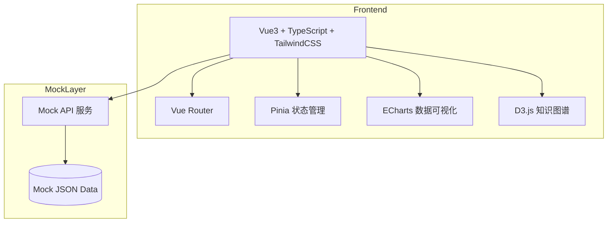

# 设备检修知识系统 - 技术架构文档

## 1. 架构设计

### 1.1 系统架构图



### 1.2 技术栈

| 层级 | 技术选型 | 说明 |
|------|---------|------|
| 前端框架 | Vue 3 + TypeScript | 组合式API (Composition API) |
| 构建工具 | Vite | 快速开发体验 |
| 样式方案 | TailwindCSS | 原子化CSS |
| 状态管理 | Pinia | Vue官方推荐状态管理 |
| 路由管理 | Vue Router 4 | SPA路由控制 |
| 图表库 | ECharts | 数据可视化 |
| 图谱引擎 | D3.js / vis-network | 知识图谱可视化 |
| UI组件 | 自定义组件 + Heroicons | 统一设计语言 |
| 图标库 | Heroicons | 线性图标风格 |
| Mock数据 | 本地JSON + axios-mock-adapter | 模拟API响应 |

---

## 2. 项目结构

```
src/
├── api/                    # API接口层
│   ├── mock/              # Mock数据
│   │   ├── equipment.ts   # 设备数据
│   │   ├── knowledge.ts  # 知识数据
│   │   ├── workorder.ts   # 工单数据
│   │   └── sparepart.ts   # 备件数据
│   └── index.ts           # API导出
│
├── assets/                # 静态资源
│   └── images/            # 图片资源
│
├── components/            # 通用组件
│   ├── common/            # 基础组件
│   │   ├── DataCard.vue      # 数据卡片
│   │   ├── SearchInput.vue   # 搜索输入框
│   │   ├── StatusBadge.vue    # 状态徽章
│   │   ├── Table.vue         # 数据表格
│   │   └── Modal.vue         # 弹窗组件
│   ├── layout/            # 布局组件
│   │   ├── AppHeader.vue     # 顶部导航
│   │   ├── AppSidebar.vue    # 侧边菜单
│   │   └── AppLayout.vue     # 整体布局
│   ├── knowledge/         # 知识模块组件
│   │   ├── KnowledgeCard.vue # 知识卡片
│   │   ├── KnowledgeFilter.vue # 知识筛选
│   │   └── KnowledgeEditor.vue # 知识编辑器
│   ├── equipment/         # 设备模块组件
│   │   ├── EquipmentCard.vue # 设备卡片
│   │   └── EquipmentStatus.vue # 设备状态
│   ├── workorder/         # 工单模块组件
│   │   ├── WorkOrderKanban.vue # 工单看板
│   │   ├── FaultForm.vue     # 故障登记表单
│   │   └── DiagnosisTree.vue # 诊断树
│   ├── sop/               # SOP模块组件
│   │   ├── SOPFlowChart.vue  # SOP流程图
│   │   └── SOPStepCard.vue   # SOP步骤卡片
│   ├── graph/             # 图谱模块组件
│   │   ├── KnowledgeGraph.vue # 知识图谱
│   │   └── GraphNode.vue     # 图谱节点
│   └── chart/             # 图表组件
│       ├── LineChart.vue     # 折线图
│       ├── BarChart.vue      # 柱状图
│       └── PieChart.vue      # 饼图
│
├── composables/           # 组合式函数
│   ├── useSearch.ts      # 搜索逻辑
│   ├── usePagination.ts  # 分页逻辑
│   └── useModal.ts       # 弹窗逻辑
│
├── pages/                # 页面组件
│   ├── Dashboard.vue         # 首页仪表盘
│   ├── knowledge/            # 知识模块
│   │   ├── KnowledgeSearch.vue  # 知识检索
│   │   ├── KnowledgeDetail.vue  # 知识详情
│   │   └── KnowledgeEditor.vue   # 知识编辑
│   ├── equipment/            # 设备模块
│   │   ├── EquipmentList.vue    # 设备列表
│   │   └── EquipmentDetail.vue  # 设备详情
│   ├── workorder/            # 工单模块
│   │   ├── WorkOrderList.vue    # 工单列表
│   │   ├── WorkOrderDetail.vue  # 工单详情
│   │   └── FaultReport.vue      # 故障登记
│   ├── sop/                  # SOP模块
│   │   ├── SOPList.vue           # SOP列表
│   │   ├── SOPDetail.vue         # SOP详情
│   │   └── SOPExecution.vue      # SOP执行
│   ├── graph/                # 图谱模块
│   │   └── KnowledgeGraph.vue     # 知识图谱
│   ├── sparepart/            # 备件模块
│   │   ├── SparePartList.vue      # 备件列表
│   │   └── InventoryDetail.vue    # 库存详情
│   └── statistics/           # 统计模块
│       └── StatisticsBoard.vue    # 统计看板
│
├── router/                # 路由配置
│   └── index.ts
│
├── stores/                # Pinia状态库
│   ├── user.ts           # 用户状态
│   ├── knowledge.ts      # 知识状态
│   ├── equipment.ts      # 设备状态
│   ├── workorder.ts      # 工单状态
│   └── sparepart.ts      # 备件状态
│
├── types/                 # TypeScript类型定义
│   ├── index.ts          # 公共类型
│   ├── knowledge.ts      # 知识类型
│   ├── equipment.ts      # 设备类型
│   ├── workorder.ts      # 工单类型
│   └── sparepart.ts      # 备件类型
│
├── utils/                # 工具函数
│   ├── format.ts         # 格式化工具
│   ├── request.ts        # 请求封装
│   └── storage.ts        # 本地存储
│
├── App.vue               # 根组件
└── main.ts               # 入口文件
```

---

## 3. 路由定义

| 路由路径 | 页面名称 | 权限要求 |
|---------|---------|---------|
| / | 首页仪表盘 | 全部用户 |
| /knowledge | 知识检索 | 全部用户 |
| /knowledge/:id | 知识详情 | 全部用户 |
| /knowledge/editor/:id? | 知识编辑 | 技术专家+ |
| /equipment | 设备台账 | 全部用户 |
| /equipment/:id | 设备详情 | 全部用户 |
| /workorder | 工单管理 | 维修工程师+ |
| /workorder/:id | 工单详情 | 维修工程师+ |
| /workorder/report | 故障登记 | 全部用户 |
| /sop | SOP管理 | 全部用户 |
| /sop/:id | SOP详情 | 全部用户 |
| /sop/execute/:id | SOP执行 | 维修工程师+ |
| /graph | 知识图谱 | 全部用户 |
| /sparepart | 备件管理 | 设备管理员+ |
| /sparepart/:id | 库存详情 | 设备管理员+ |
| /statistics | 统计分析 | 主管+ |

---

## 4. 数据模型

### 4.1 核心数据实体

#### 4.1.1 设备 (Equipment)
```typescript
interface Equipment {
  id: string
  code: string           // 设备编号
  name: string           // 设备名称
  type: string           // 设备类型
  typePath: string[]     // 类型路径 ["金属切削机床", "车床", "卧式车床"]
  status: 'normal' | 'warning' | 'fault' | 'maintenance' | 'stopped'
  department: string     // 所属部门
  location: string       // 安装位置
  criticality: 'A' | 'B' | 'C' | 'D'  // 关键度等级
  manufacturer: string   // 制造商
  model: string          // 型号
  serialNumber: string   // 出厂编号
  installDate: string    // 安装日期
  parameters: Record<string, any>  // 技术参数
  imageUrl?: string      // 设备图片
}
```

#### 4.1.2 知识 (Knowledge)
```typescript
interface Knowledge {
  id: string
  title: string
  summary: string
  content: string
  type: 'fault_solution' | 'maintenance_guide' | 'safety_procedure' | 'manual' | 'standard' | 'training'
  status: 'draft' | 'pending' | 'published' | 'archived'
  author: User
  tags: string[]
  equipmentTypes: string[]  // 适用设备类型
  faultTypes: string[]      // 关联故障类型
  rating: number            // 平均评分
  viewCount: number         // 浏览次数
  likeCount: number         // 点赞数
  createdAt: string
  updatedAt: string
  attachments: Attachment[]
}
```

#### 4.1.3 工单 (WorkOrder)
```typescript
interface WorkOrder {
  id: string
  code: string
  type: 'fault_repair' | 'planned_maintenance' | 'inspection' | 'emergency' | 'modification'
  status: 'created' | 'pending_dispatch' | 'dispatched' | 'accepted' | 'processing' | 'pending_acceptance' | 'completed' | 'cancelled'
  priority: 'P1' | 'P2' | 'P3' | 'P4'
  equipment: Equipment
  fault: Fault
  assignee?: User
  reporter: User
  estimatedDuration: number  // 预计工时(分钟)
  actualDuration?: number     // 实际工时
  steps: WorkOrderStep[]
  spareParts: SparePartUsage[]
  discussion?: Discussion[]
  rating?: { quality: number; speed: number; attitude: number }
  createdAt: string
  completedAt?: string
}
```

#### 4.1.4 故障 (Fault)
```typescript
interface Fault {
  id: string
  phenomenon: string           // 故障现象
  phenomenonCategory: string[] // 现象分类路径 ["异响", "机械异响", "主轴异响"]
  severity: 'P1' | 'P2' | 'P3' | 'P4'
  mediaFiles: MediaFile[]     // 多媒体证据
  locationMark?: {x: number, y: number}  // 位置标记
  diagnosis?: FaultDiagnosis   // 诊断信息
  rootCause?: string          // 根本原因
  relatedKnowledge?: Knowledge[] // 关联知识
  createdAt: string
}

interface FaultDiagnosis {
  process: DiagnosisStep[]     // 诊断过程
  fiveWhy?: string[]           // 5Why分析
  finalCause?: string          // 最终确认原因
  causeCategory?: string       // 原因分类
}
```

#### 4.1.5 备件 (SparePart)
```typescript
interface SparePart {
  id: string
  code: string
  name: string
  category: 'A' | 'B' | 'C'     // ABC分类
  unit: string                 // 单位
  stock: number                // 当前库存
  safeStock: number            // 安全库存
  maxStock: number             // 最大库存
  price: number               // 单价
  location: string            // 存放位置
  applicableEquipment: string[] // 适用设备
  batches: StockBatch[]       // 批次信息
  lastInDate?: string         // 最近入库日期
  lastOutDate?: string        // 最近出库日期
  status: 'normal' | 'low' | 'overstock' | 'stagnant' | 'expiring'
}
```

#### 4.1.6 SOP
```typescript
interface SOP {
  id: string
  code: string
  name: string
  equipmentScope: string[]     // 适用设备范围
  jobType: 'daily_maintenance' | 'periodic_maintenance' | 'fault_repair' | 'safety_check' | 'calibration'
  version: string
  effectiveDate: string
  author: User
  approver?: User
  steps: SOPStep[]
  checklist: ChecklistItem[]
  resources: {
    tools: Tool[]
    spareParts: string[]
    personnel: { role: string; count: number; skills: string[] }[]
    ppe: string[]  // 个人防护用品
  }
  totalEstimatedTime: number
}

interface SOPStep {
  order: number
  title: string
  description: string
  keyPoints?: string[]
  safetyNotes?: string
  media?: MediaFile[]
  checkStandard?: string
  tools?: string[]
  estimatedTime: number
}
```

#### 4.1.7 知识图谱 (KnowledgeGraph)
```typescript
interface GraphNode {
  id: string
  type: 'equipment' | 'component' | 'fault' | 'cause' | 'solution' | 'sparepart' | 'tool' | 'sop'
  label: string
  properties: Record<string, any>
}

interface GraphEdge {
  id: string
  source: string
  target: string
  type: 'contains' | 'occurs' | 'causes' | 'solves' | 'needs_sparepart' | 'uses_tool' | 'follows' | 'references' | 'precedes' | 'similar'
  weight?: number
}

interface KnowledgeGraph {
  nodes: GraphNode[]
  edges: GraphEdge[]
}
```

---

## 5. 状态管理设计

### 5.1 Store模块划分

| Store | 职责 | 核心State | 核心Actions |
|-------|------|----------|------------|
| useUserStore | 用户状态 | user, isLoggedIn, permissions | login, logout, updateProfile |
| useKnowledgeStore | 知识状态 | knowledgeList, currentKnowledge, filters | fetchList, fetchDetail, create, update, delete |
| useEquipmentStore | 设备状态 | equipmentList, currentEquipment, filters | fetchList, fetchDetail, updateStatus |
| useWorkOrderStore | 工单状态 | workOrderList, currentOrder, kanban | fetchList, fetchDetail, create, updateStatus, dispatch |
| useSparePartStore | 备件状态 | sparePartList, stockAlerts | fetchList, fetchDetail, updateStock |
| useGraphStore | 图谱状态 | nodes, edges, selectedNode | fetchGraph, addNode, removeNode, addEdge |
| useStatisticsStore | 统计状态 | dashboardStats, equipmentStats, workOrderStats | fetchDashboard, fetchEquipmentStats, fetchWorkOrderStats |

---

## 6. Mock数据策略

### 6.1 Mock数据文件

| 文件 | 数据量 | 说明 |
|------|-------|------|
| equipment.json | 50条 | 设备台账数据 |
| knowledge.json | 100条 | 知识条目数据 |
| workorder.json | 80条 | 工单记录数据 |
| sparepart.json | 200条 | 备件库存数据 |
| sop.json | 30条 | SOP模板数据 |
| graph.json | 1份 | 图谱关系数据 |
| user.json | 20条 | 用户数据 |

### 6.2 Mock API格式

```typescript
// 响应格式
interface ApiResponse<T> {
  code: number
  message: string
  data: T
  pagination?: {
    page: number
    pageSize: number
    total: number
    totalPages: number
  }
}

// 示例：获取设备列表
GET /api/equipment
Query: { page, pageSize, status?, type?, department? }
Response: ApiResponse<Equipment[]>
```

---

## 7. 组件库设计

### 7.1 基础组件

| 组件 | 用途 | Props |
|------|------|-------|
| DataCard | 数据统计卡片 | title, value, trend, icon, color |
| SearchInput | 搜索输入框 | placeholder, onSearch, onChange |
| StatusBadge | 状态徽章 | status, type |
| DataTable | 数据表格 | columns, data, loading, pagination |
| Modal | 弹窗 | visible, title, onClose |
| Select | 下拉选择 | options, value, onChange |
| DatePicker | 日期选择 | value, onChange, range |
| FileUpload | 文件上传 | accept, maxSize, onUpload |
| ImageUpload | 图片上传 | preview, onChange |

### 7.2 业务组件

| 组件 | 用途 | Props |
|------|------|-------|
| KnowledgeCard | 知识条目卡片 | knowledge, onClick |
| EquipmentStatus | 设备状态指示 | status, size |
| WorkOrderKanban | 工单看板列 | orders, onDragEnd |
| FaultForm | 故障登记表单 | equipment, onSubmit |
| SOPFlowChart | SOP流程图 | steps, currentStep |
| KnowledgeGraph | 知识图谱 | nodes, edges, onNodeClick |
| StatLineChart | 统计折线图 | data, xKey, yKey |
| StatBarChart | 统计柱状图 | data, xKey, yKey |
| StatPieChart | 统计饼图 | data, nameKey, valueKey |

---

## 8. 性能优化策略

1. **路由懒加载**：页面组件按需加载
2. **数据缓存**：使用Pinia持久化常用数据
3. **虚拟滚动**：长列表使用虚拟滚动
4. **图片优化**：图片懒加载 + 压缩
5. **防抖节流**：搜索输入防抖500ms
6. **骨架屏**：数据加载显示骨架屏

---

## 9. 开发规范

### 9.1 代码规范

- **组件命名**：PascalCase，如 `KnowledgeCard.vue`
- **组件结构**：`template` → `script setup` → `style`
- **TypeScript**：严格模式，完整类型定义
- **样式规范**：TailwindCSS原子类为主，少量自定义样式
- **注释规范**：复杂逻辑添加中文注释

### 9.2 Git提交规范

```
feat: 新功能
fix: 修复bug
docs: 文档更新
style: 代码格式
refactor: 重构
test: 测试
chore: 构建/工具
```
