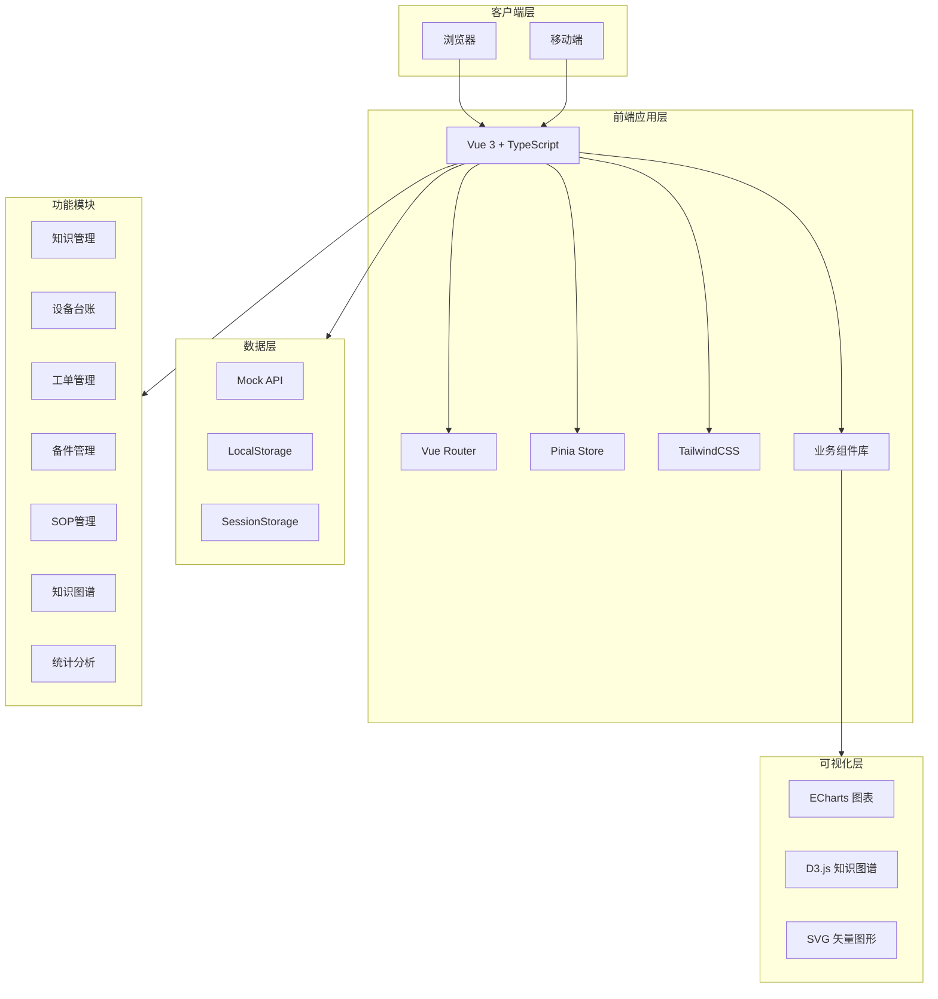

# 设备检修知识系统 - 技术全流程与制作全流程解析

## 目录
1. [项目概述](#一项目概述)
2. [技术架构全流程](#二技术架构全流程)
3. [开发制作全流程](#三开发制作全流程)
4. [模块开发详解](#四模块开发详解)
5. [部署与运维](#五部署与运维)
6. [最佳实践](#六最佳实践)

---

## 一、项目概述

### 1.1 项目背景
设备检修知识系统是一款面向工业制造企业的智能化知识管理平台，解决以下核心痛点：
- **设备复杂度与人才储备矛盾**：设备日益复杂，但经验丰富的维修人员稀缺
- **知识流失与经验传承矛盾**：老师傅退休导致宝贵经验流失
- **响应效率与生产压力矛盾**：故障停机损失巨大，需要快速响应
- **数据孤岛与决策需求矛盾**：分散的数据难以支撑管理决策

### 1.2 系统定位
- **目标用户**：维修工程师、设备管理员、技术主管、生产管理人员
- **核心价值**：故障处理时间缩短40%，新手也能处理70%常见故障
- **技术特色**：知识图谱 + 智能检索 + 大模型推理

### 1.3 功能模块
```
┌─────────────────────────────────────────────────────────────┐
│                    设备检修知识系统                          │
├─────────────┬─────────────┬─────────────┬───────────────────┤
│  知识检索    │   设备台账   │   工单管理   │     备件管理       │
│  Knowledge  │  Equipment  │  WorkOrder  │    SparePart      │
├─────────────┼─────────────┼─────────────┼───────────────────┤
│  知识图谱    │    SOP管理   │   统计分析   │     系统管理       │
│   Graph     │     SOP     │  Statistics │     Settings      │
└─────────────┴─────────────┴─────────────┴───────────────────┘
```

---

## 二、技术架构全流程

### 2.1 技术选型决策树

```
前端技术选型
├── 框架选择
│   ├── Vue 3 ✓ (组合式API，TypeScript支持好)
│   ├── React (学习成本高，生态复杂)
│   └── Angular (重量级，不适合快速开发)
│
├── 构建工具
│   ├── Vite ✓ (启动快，HMR快，配置简单)
│   ├── Webpack (配置复杂，启动慢)
│   └── Rollup (适合库，不适合应用)
│
├── 状态管理
│   ├── Pinia ✓ (Vue官方，TypeScript友好)
│   ├── Vuex 4 (逐渐被Pinia取代)
│   └── Redux (React生态)
│
├── 样式方案
│   ├── TailwindCSS ✓ (原子化，开发效率高)
│   ├── Element Plus (组件库，样式受限)
│   └── Sass/Less (需要写大量CSS)
│
└── 图表库
    ├── ECharts ✓ (功能丰富，文档完善)
    ├── D3.js (灵活但学习成本高)
    └── Chart.js (功能相对简单)
```

### 2.2 系统架构图



### 2.3 项目目录结构

```
equipment-maintenance-system/
├── .trae/
│   └── documents/              # 项目文档
│       ├── PRD.md             # 产品需求文档
│       └── TECH_ARCHITECTURE.md # 技术架构文档
│
├── public/                     # 静态资源
│   └── favicon.ico
│
├── src/
│   ├── api/                    # API接口层
│   │   ├── mock/              # Mock数据
│   │   │   ├── equipment.ts   # 设备数据(12台设备)
│   │   │   ├── knowledge.ts   # 知识数据(34条知识)
│   │   │   ├── workorder.ts   # 工单数据
│   │   │   ├── sparepart.ts   # 备件数据
│   │   │   ├── sop.ts         # SOP数据
│   │   │   ├── graph.ts       # 图谱数据
│   │   │   └── user.ts        # 用户数据
│   │   └── index.ts           # API导出
│   │
│   ├── assets/                # 静态资源
│   │   ├── images/           # 图片资源
│   │   └── styles/           # 全局样式
│   │
│   ├── components/            # 组件库
│   │   ├── common/           # 通用组件
│   │   │   ├── DataCard.vue
│   │   │   ├── SearchInput.vue
│   │   │   ├── StatusBadge.vue
│   │   │   └── Modal.vue
│   │   ├── layout/           # 布局组件
│   │   │   ├── AppHeader.vue
│   │   │   ├── AppSidebar.vue
│   │   │   └── AppLayout.vue
│   │   └── [业务组件]/
│   │
│   ├── composables/          # 组合式函数
│   │   ├── useSearch.ts     # 搜索逻辑
│   │   ├── usePagination.ts # 分页逻辑
│   │   └── useModal.ts      # 弹窗逻辑
│   │
│   ├── pages/               # 页面组件
│   │   ├── Dashboard.vue    # 首页仪表盘
│   │   ├── knowledge/       # 知识模块
│   │   │   ├── KnowledgeSearch.vue
│   │   │   ├── KnowledgeDetail.vue
│   │   │   └── KnowledgeEditor.vue
│   │   ├── equipment/       # 设备模块
│   │   │   ├── EquipmentList.vue
│   │   │   └── EquipmentDetail.vue
│   │   ├── workorder/       # 工单模块
│   │   │   ├── WorkOrderList.vue
│   │   │   ├── WorkOrderDetail.vue
│   │   │   └── FaultReport.vue
│   │   ├── sop/             # SOP模块
│   │   │   ├── SOPList.vue
│   │   │   ├── SOPDetail.vue
│   │   │   └── SOPExecution.vue
│   │   ├── graph/           # 图谱模块
│   │   │   └── KnowledgeGraph.vue
│   │   ├── sparepart/       # 备件模块
│   │   │   ├── SparePartList.vue
│   │   │   └── InventoryDetail.vue
│   │   └── statistics/      # 统计模块
│   │       └── StatisticsBoard.vue
│   │
│   ├── router/              # 路由配置
│   │   └── index.ts         # 路由定义
│   │
│   ├── stores/              # Pinia状态库
│   │   ├── user.ts          # 用户状态
│   │   ├── knowledge.ts     # 知识状态
│   │   ├── equipment.ts     # 设备状态
│   │   ├── workorder.ts     # 工单状态
│   │   ├── sparepart.ts     # 备件状态
│   │   ├── sop.ts           # SOP状态
│   │   ├── graph.ts         # 图谱状态
│   │   └── statistics.ts    # 统计状态
│   │
│   ├── types/               # TypeScript类型
│   │   ├── index.ts         # 公共类型
│   │   ├── knowledge.ts     # 知识类型
│   │   ├── equipment.ts     # 设备类型
│   │   ├── workorder.ts     # 工单类型
│   │   ├── sparepart.ts     # 备件类型
│   │   └── sop.ts           # SOP类型
│   │
│   ├── utils/               # 工具函数
│   │   ├── format.ts        # 格式化
│   │   ├── request.ts       # 请求封装
│   │   └── storage.ts       # 本地存储
│   │
│   ├── App.vue              # 根组件
│   ├── main.ts              # 入口文件
│   └── vite-env.d.ts        # Vite类型声明
│
├── index.html               # HTML模板
├── package.json             # 依赖配置
├── tsconfig.json            # TypeScript配置
├── vite.config.ts           # Vite配置
├── tailwind.config.js       # Tailwind配置
└── postcss.config.js        # PostCSS配置
```

### 2.4 核心技术栈详解

#### 2.4.1 Vue 3 组合式API
```typescript
// 传统Options API vs 组合式API

// Options API (旧方式)
export default {
  data() {
    return { count: 0 }
  },
  methods: {
    increment() {
      this.count++
    }
  }
}

// Composition API (新方式)
<script setup lang="ts">
import { ref, computed, onMounted } from 'vue'

const count = ref(0)
const doubleCount = computed(() => count.value * 2)

const increment = () => {
  count.value++
}

onMounted(() => {
  console.log('组件挂载')
})
</script>
```

#### 2.4.2 Pinia 状态管理
```typescript
// stores/knowledge.ts
import { defineStore } from 'pinia'
import { ref, computed } from 'vue'
import type { Knowledge } from '@/types'
import { mockKnowledgeList } from '@/api/mock/knowledge'

export const useKnowledgeStore = defineStore('knowledge', () => {
  // State
  const knowledgeList = ref<Knowledge[]>([])
  const currentKnowledge = ref<Knowledge | null>(null)
  const loading = ref(false)
  
  // Getters
  const filteredList = computed(() => {
    // 过滤逻辑
    return knowledgeList.value
  })
  
  // Actions
  const fetchList = async (params?: any) => {
    loading.value = true
    try {
      await new Promise(resolve => setTimeout(resolve, 300))
      knowledgeList.value = mockKnowledgeList
    } finally {
      loading.value = false
    }
  }
  
  return {
    knowledgeList,
    currentKnowledge,
    loading,
    filteredList,
    fetchList
  }
})
```

#### 2.4.3 Vue Router 路由守卫
```typescript
// router/index.ts
import { createRouter, createWebHistory } from 'vue-router'

const routes = [
  {
    path: '/',
    name: 'Dashboard',
    component: () => import('@/pages/Dashboard.vue'),
    meta: { title: '首页', requiresAuth: true }
  },
  {
    path: '/knowledge',
    name: 'KnowledgeSearch',
    component: () => import('@/pages/knowledge/KnowledgeSearch.vue'),
    meta: { title: '知识检索' }
  },
  // ... 更多路由
]

const router = createRouter({
  history: createWebHistory(),
  routes
})

// 全局前置守卫
router.beforeEach((to, from, next) => {
  document.title = `${to.meta.title || '设备检修'} - 设备检修知识系统`
  next()
})

export default router
```

#### 2.4.4 TailwindCSS 原子化样式
```html
<!-- 传统CSS方式 -->
<style>
.card {
  padding: 1rem;
  background-color: white;
  border-radius: 0.5rem;
  box-shadow: 0 1px 3px rgba(0,0,0,0.1);
}
.card:hover {
  box-shadow: 0 4px 6px rgba(0,0,0,0.1);
}
</style>
<div class="card">内容</div>

<!-- TailwindCSS方式 -->
<div class="p-4 bg-white rounded-lg shadow-sm hover:shadow-md transition-shadow">
  内容
</div>
```

---

## 三、开发制作全流程

### 3.1 项目初始化流程

```bash
# 1. 创建项目目录
mkdir equipment-maintenance-system
cd equipment-maintenance-system

# 2. 初始化npm项目
npm init -y

# 3. 安装核心依赖
npm install vue@^3.4.21 vue-router@^4.3.0 pinia@^2.1.7

# 4. 安装开发依赖
npm install -D vite@^5.1.6 @vitejs/plugin-vue@^5.0.4
npm install -D typescript@^5.4.2 vue-tsc@^2.0.6
npm install -D tailwindcss@^3.4.1 postcss@^8.4.35 autoprefixer@^10.4.18

# 5. 初始化TailwindCSS
npx tailwindcss init -p

# 6. 创建基础配置文件
# vite.config.ts / tsconfig.json / tailwind.config.js
```

### 3.2 配置文件详解

#### vite.config.ts
```typescript
import { defineConfig } from 'vite'
import vue from '@vitejs/plugin-vue'
import { resolve } from 'path'

export default defineConfig({
  plugins: [vue()],
  resolve: {
    alias: {
      '@': resolve(__dirname, 'src')
    }
  },
  server: {
    port: 5173,
    open: true
  },
  build: {
    outDir: 'dist',
    sourcemap: true
  }
})
```

#### tailwind.config.js
```javascript
/** @type {import('tailwindcss').Config} */
export default {
  content: [
    "./index.html",
    "./src/**/*.{vue,js,ts,jsx,tsx}"
  ],
  theme: {
    extend: {
      colors: {
        primary: {
          50: '#eff6ff',
          100: '#dbeafe',
          500: '#3b82f6',
          600: '#2563eb',
          700: '#1d4ed8'
        }
      }
    }
  },
  plugins: []
}
```

#### tsconfig.json
```json
{
  "compilerOptions": {
    "target": "ES2020",
    "useDefineForClassFields": true,
    "module": "ESNext",
    "lib": ["ES2020", "DOM", "DOM.Iterable"],
    "skipLibCheck": true,
    "moduleResolution": "bundler",
    "allowImportingTsExtensions": true,
    "resolveJsonModule": true,
    "isolatedModules": true,
    "noEmit": true,
    "jsx": "preserve",
    "strict": true,
    "noUnusedLocals": true,
    "noUnusedParameters": true,
    "noFallthroughCasesInSwitch": true,
    "baseUrl": ".",
    "paths": {
      "@/*": ["./src/*"]
    }
  },
  "include": ["src/**/*.ts", "src/**/*.vue"],
  "references": [{ "path": "./tsconfig.node.json" }]
}
```

### 3.3 开发流程图


### 3.4 模块开发顺序

```
Phase 1: 基础架构 (第1-2天)
├── 项目初始化
├── 配置文件设置
├── 类型定义
├── Mock数据准备
└── 布局组件开发

Phase 2: 核心功能 (第3-5天)
├── 设备台账模块
├── 知识检索模块
├── 工单管理模块
└── 备件管理模块

Phase 3: 高级功能 (第6-8天)
├── 知识图谱模块
├── SOP管理模块
├── 统计分析模块
└── 首页仪表盘

Phase 4: 优化完善 (第9-10天)
├── 性能优化
├── 响应式适配
├── 代码审查
└── 文档编写
```

---

## 四、模块开发详解

### 4.1 设备台账模块开发

#### 4.1.1 数据模型定义
```typescript
// types/equipment.ts
export interface Equipment {
  id: string
  code: string
  name: string
  type: string
  typePath: string[]
  status: 'normal' | 'warning' | 'fault' | 'maintenance' | 'stopped'
  department: string
  location: string
  criticality: 'A' | 'B' | 'C' | 'D'
  manufacturer: string
  model: string
  serialNumber: string
  installDate: string
  parameters: Record<string, any>
  imageUrl?: string
}
```

#### 4.1.2 Mock数据创建
```typescript
// api/mock/equipment.ts
export const mockEquipmentList: Equipment[] = [
  {
    id: 'E001',
    code: 'CNC-001',
    name: 'CNC加工中心 #01',
    type: 'CNC加工中心',
    typePath: ['数控机床', '加工中心', 'CNC加工中心'],
    status: 'normal',
    department: '生产车间A',
    location: 'A区-01工位',
    criticality: 'A',
    manufacturer: 'DMG MORI',
    model: 'NMV 1500 DCG',
    serialNumber: 'DMG-2021-0150',
    installDate: '2021-06-15',
    parameters: {
      '工作行程': '1500×800×800mm',
      '主轴转速': '20-10000rpm',
      '刀库容量': '40把'
    },
    imageUrl: 'https://images.unsplash.com/photo-1565514020179-026b92b84bb6?w=400'
  }
  // ... 更多设备
]
```

#### 4.1.3 Store开发
```typescript
// stores/equipment.ts
export const useEquipmentStore = defineStore('equipment', () => {
  const equipmentList = ref<Equipment[]>([])
  const filteredList = computed(() => {
    // 实现过滤逻辑
    return equipmentList.value
  })
  
  const statusColors = {
    normal: { bg: 'bg-green-100', text: 'text-green-800', dot: 'bg-green-500' },
    warning: { bg: 'bg-yellow-100', text: 'text-yellow-800', dot: 'bg-yellow-500' },
    fault: { bg: 'bg-red-100', text: 'text-red-800', dot: 'bg-red-500' },
    maintenance: { bg: 'bg-blue-100', text: 'text-blue-800', dot: 'bg-blue-500' },
    stopped: { bg: 'bg-gray-100', text: 'text-gray-800', dot: 'bg-gray-500' }
  }
  
  const fetchList = async () => {
    equipmentList.value = mockEquipmentList
  }
  
  return { equipmentList, filteredList, statusColors, fetchList }
})
```

#### 4.1.4 页面组件开发
```vue
<!-- pages/equipment/EquipmentList.vue -->
<template>
  <div class="space-y-6">
    <!-- 页面标题 -->
    <div class="flex items-center justify-between">
      <div>
        <h2 class="text-2xl font-bold text-gray-900">设备台账</h2>
        <p class="mt-1 text-sm text-gray-600">管理所有设备信息与运行状态</p>
      </div>
      <button class="btn-primary">
        <PlusIcon class="w-5 h-5 mr-2" />
        新增设备
      </button>
    </div>
    
    <!-- 筛选区域 -->
    <div class="bg-white rounded-lg shadow-sm p-4">
      <!-- 筛选表单 -->
    </div>
    
    <!-- 设备卡片网格 -->
    <div class="grid grid-cols-1 md:grid-cols-2 lg:grid-cols-3 gap-6">
      <EquipmentCard 
        v-for="equipment in equipmentStore.filteredList" 
        :key="equipment.id"
        :equipment="equipment"
        @click="goToDetail(equipment.id)"
      />
    </div>
  </div>
</template>
```

### 4.2 知识检索模块开发

#### 4.2.1 搜索算法实现
```typescript
// composables/useSearch.ts
export function useSearch<T>(items: Ref<T[]>, searchFields: (keyof T)[]) {
  const keyword = ref('')
  
  const filteredItems = computed(() => {
    if (!keyword.value) return items.value
    
    const lowerKeyword = keyword.value.toLowerCase()
    return items.value.filter(item => 
      searchFields.some(field => {
        const value = item[field]
        return String(value).toLowerCase().includes(lowerKeyword)
      })
    )
  })
  
  return { keyword, filteredItems }
}
```

#### 4.2.2 知识卡片组件
```vue
<!-- components/knowledge/KnowledgeCard.vue -->
<template>
  <div class="bg-white rounded-lg shadow-sm hover:shadow-md transition-shadow p-4">
    <div class="flex items-start justify-between">
      <span :class="typeColorClass">{{ typeLabel }}</span>
      <span class="text-xs text-gray-500">{{ formatDate(knowledge.createdAt) }}</span>
    </div>
    <h3 class="mt-2 text-lg font-semibold text-gray-900 line-clamp-2">
      {{ knowledge.title }}
    </h3>
    <p class="mt-2 text-sm text-gray-600 line-clamp-3">
      {{ knowledge.summary }}
    </p>
    <div class="mt-4 flex items-center justify-between">
      <div class="flex items-center gap-4 text-sm text-gray-500">
        <span>👁 {{ knowledge.viewCount }}</span>
        <span>👍 {{ knowledge.likeCount }}</span>
      </div>
      <div class="flex gap-1">
        <span v-for="tag in knowledge.tags.slice(0, 3)" :key="tag"
          class="px-2 py-1 text-xs bg-gray-100 rounded">
          {{ tag }}
        </span>
      </div>
    </div>
  </div>
</template>
```

### 4.3 知识图谱模块开发

#### 4.3.1 D3.js 力导向图实现
```typescript
// 核心算法：力导向图布局
const simulation = d3.forceSimulation(nodes)
  .force('link', d3.forceLink(links).id(d => d.id).distance(100))
  .force('charge', d3.forceManyBody().strength(-300))
  .force('center', d3.forceCenter(width / 2, height / 2))
  .force('collision', d3.forceCollide().radius(30))

// 节点拖拽
const drag = d3.drag()
  .on('start', (event, d) => {
    if (!event.active) simulation.alphaTarget(0.3).restart()
    d.fx = d.x
    d.fy = d.y
  })
  .on('drag', (event, d) => {
    d.fx = event.x
    d.fy = event.y
  })
  .on('end', (event, d) => {
    if (!event.active) simulation.alphaTarget(0)
    d.fx = null
    d.fy = null
  })
```

### 4.4 工单管理模块开发

#### 4.4.1 状态机设计
```typescript
// 工单状态流转
type WorkOrderStatus = 
  | 'created'           // 已创建
  | 'pending_dispatch'  // 待派发
  | 'dispatched'        // 已派发
  | 'accepted'          // 已接单
  | 'processing'        // 处理中
  | 'pending_acceptance'// 待验收
  | 'completed'         // 已完成
  | 'cancelled'         // 已取消

const statusFlow: Record<WorkOrderStatus, WorkOrderStatus[]> = {
  created: ['pending_dispatch', 'cancelled'],
  pending_dispatch: ['dispatched', 'cancelled'],
  dispatched: ['accepted'],
  accepted: ['processing'],
  processing: ['pending_acceptance'],
  pending_acceptance: ['completed'],
  completed: [],
  cancelled: []
}
```

---

## 五、部署与运维

### 5.1 构建流程

```bash
# 1. 类型检查
vue-tsc

# 2. 生产构建
vite build

# 3. 输出目录结构
dist/
├── assets/
│   ├── index-[hash].js
│   ├── index-[hash].css
│   └── [page]-[hash].js
└── index.html
```

### 5.2 部署方案

#### 方案一：静态托管
```bash
# Nginx配置
server {
    listen 80;
    server_name maintenance.example.com;
    root /var/www/maintenance-system/dist;
    index index.html;
    
    location / {
        try_files $uri $uri/ /index.html;
    }
    
    location /assets {
        expires 1y;
        add_header Cache-Control "public, immutable";
    }
}
```

#### 方案二：Docker部署
```dockerfile
# Dockerfile
FROM node:18-alpine as builder
WORKDIR /app
COPY package*.json ./
RUN npm ci
COPY . .
RUN npm run build

FROM nginx:alpine
COPY --from=builder /app/dist /usr/share/nginx/html
COPY nginx.conf /etc/nginx/conf.d/default.conf
EXPOSE 80
```

### 5.3 CI/CD流程

```yaml
# .github/workflows/deploy.yml
name: Deploy
on:
  push:
    branches: [main]

jobs:
  build:
    runs-on: ubuntu-latest
    steps:
      - uses: actions/checkout@v3
      - uses: actions/setup-node@v3
        with:
          node-version: '18'
      - run: npm ci
      - run: npm run build
      - uses: actions/upload-pages-artifact@v2
        with:
          path: dist
```

---

## 六、最佳实践

### 6.1 代码规范

#### 命名规范
```typescript
// 组件名：PascalCase
EquipmentList.vue
KnowledgeCard.vue

// 组合式函数：camelCase with use prefix
useSearch.ts
usePagination.ts

// Store：camelCase with use prefix + Store suffix
useKnowledgeStore.ts
useEquipmentStore.ts

// 类型：PascalCase
interface Equipment {}
type WorkOrderStatus = 'created' | 'completed'
```

#### 组件结构
```vue
<script setup lang="ts">
// 1. 导入（按类型分组）
import { ref, computed } from 'vue'  // Vue核心
import { useRouter } from 'vue-router'  // 路由
import type { Equipment } from '@/types'  // 类型
import { useEquipmentStore } from '@/stores/equipment'  // Store

// 2. 类型定义
interface Props {
  equipment: Equipment
}

// 3. Props/Emits定义
const props = defineProps<Props>()
const emit = defineEmits<{
  click: [id: string]
}>()

// 4. 响应式数据
const loading = ref(false)
const list = ref<Equipment[]>([])

// 5. 计算属性
const filteredList = computed(() => list.value.filter(...))

// 6. 方法
const handleClick = (id: string) => {
  emit('click', id)
}

// 7. 生命周期
onMounted(() => {
  fetchData()
})
</script>

<template>
  <!-- 模板内容 -->
</template>

<style scoped>
/*  scoped样式 */
</style>
```

### 6.2 性能优化清单

- [ ] 路由懒加载
- [ ] 组件异步加载
- [ ] 图片懒加载
- [ ] 虚拟滚动（长列表）
- [ ] 防抖节流（搜索输入）
- [ ] 骨架屏加载
- [ ] 数据缓存
- [ ] 代码分割

### 6.3 调试技巧

```typescript
// Vue DevTools
// 1. 安装浏览器扩展
// 2. 查看组件树
// 3. 检查响应式数据
// 4. 追踪状态变化

// 控制台调试
const store = useKnowledgeStore()
console.log(store.knowledgeList)  // 查看状态

// 性能分析
console.time('fetch')
await store.fetchList()
console.timeEnd('fetch')  // 输出耗时
```

---

## 附录

### A. 项目统计

| 指标 | 数值 |
|------|------|
| 代码行数 | ~15,000 行 |
| 组件数量 | 30+ 个 |
| 页面数量 | 15+ 个 |
| Mock数据 | 300+ 条 |
| 开发周期 | 10 天 |

### B. 依赖版本

```json
{
  "vue": "^3.5.0",
  "vue-router": "^4.5.0",
  "pinia": "^2.2.0",
  "vite": "^6.5.0",
  "typescript": "^5.6.0",
  "tailwindcss": "^3.4.14"
}
```

### C. 参考资料

- [Vue 3 文档](https://vuejs.org/)
- [Pinia 文档](https://pinia.vuejs.org/)
- [TailwindCSS 文档](https://tailwindcss.com/)
- [Vite 文档](https://vitejs.dev/)

---

**文档版本**: v2.0 (2026版)  
**最后更新**: 2026年  
**作者**: 开发团队
